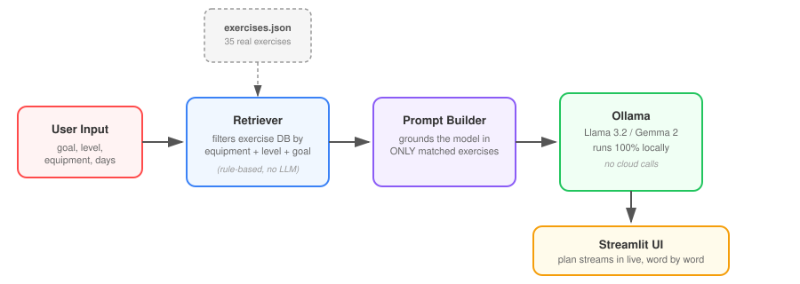

# 🏋️ AI Workout Planner

**A local-first AI fitness coach — built with Llama/Gemma and Retrieval-Augmented Generation (RAG), running entirely on-device with zero cloud calls.**


Generates a personalized, structured workout plan from your goals, fitness level, and available equipment — using a real local LLM (Llama 3.2 or Gemma 2) grounded in an actual exercise database, so it can't invent an exercise that doesn't exist or a rep scheme pulled from nowhere.

---

## ✨ Why this project

Most "AI wrapper" projects just pipe a prompt straight to a model and hope for a good answer. This one doesn't. It uses the **RAG (Retrieval-Augmented Generation)** pattern: your requirements first filter a real, structured exercise database down to what's actually valid for you — then the LLM's job is only to *organize and explain* that verified data, not invent it from scratch. That distinction is the difference between a toy demo and something you could actually trust the output of.

It also runs **100% locally** — no API keys, no per-request cost, no data leaving your machine. The whole stack (model + app) runs on a base MacBook Air.

## 🖼️ How it works



1. **You provide requirements** — goal, fitness level, equipment, days/week, session length
2. **`retriever.py` filters the exercise database** — rule-based matching on equipment (do you actually have a pull-up bar?) and difficulty (nothing above your level)
3. **A prompt is built** containing *only* the matched, verified exercises as context
4. **Ollama runs the LLM locally** (Llama 3.2 or Gemma 2) to organize those exercises into a coherent weekly plan
5. **The plan streams back live**, word by word, in the Streamlit UI

## 🎯 Features

- Real local LLM inference — no OpenAI/Anthropic API key required
- Grounded generation — the model can only use exercises that exist in the database, eliminating hallucinated exercises or fabricated rep schemes
- Built-in safety guardrail — if you mention pain or injury, the model is instructed to redirect you to a professional instead of prescribing around it
- Two interfaces: a polished Streamlit web app, and a lightweight CLI
- Swappable models — works with any Ollama model (Llama, Gemma, Mistral, Qwen...)
- Fully customizable knowledge base — just edit a JSON file, no retraining needed

## 📸 Demo

*(Run it locally and drop a screenshot or short screen recording here before publishing — this is the first thing people look at on GitHub/LinkedIn.)*

## 🛠️ Tech stack

| Layer | Tool |
|---|---|
| LLM runtime | [Ollama](https://ollama.com) (Llama 3.2 / Gemma 2, running locally) |
| Web UI | [Streamlit](https://streamlit.io) |
| Retrieval | Rule-based filtering over a structured JSON knowledge base |
| Language | Python 3.10+ |

## 🚀 Setup

```bash
# 1. Install and start Ollama
brew install ollama
ollama serve

# 2. Pull a model
ollama pull gemma2:2b        # or: ollama pull llama3.2:3b

# 3. Clone this repo and install dependencies
git clone https://github.com/preetham754/AI-Workout-Planner.git
cd AI-Workout-Planner
pip install -r requirements.txt
```

### Run the web app (recommended)

```bash
streamlit run app.py
```

Opens at `http://localhost:8501`. Set your goal, level, equipment, and days/week, then click **Generate my workout plan**.

### Run the CLI version

```bash
python3 workout.py
```

## 📁 Project structure

```
AI-Workout-Planner/
├── app.py              # Streamlit web app
├── workout.py           # CLI version
├── retriever.py          # Filters exercises by goal/equipment/level
├── data/
│   └── exercises.json    # Exercise knowledge base (35 exercises)
├── architecture.svg      # Architecture diagram
├── requirements.txt
├── .streamlit/
│   └── config.toml       # App theme
└── LICENSE
```

## 🔧 Customizing it

- **Add your own exercises:** edit `data/exercises.json` — no code changes or retraining needed
- **Add new goals:** extend `GOAL_TO_CATEGORIES` in `retriever.py`
- **Change the plan structure or tone:** edit `SYSTEM_PROMPT` in `app.py` / `workout.py`
- **Use a different model:** any Ollama model works — `ollama pull <model>` then select it in the sidebar

## 🗺️ Possible next steps

- [ ] Swap rule-based retrieval for semantic search (embeddings) to support free-text requests like *"I want to build a bigger chest"*
- [ ] Persist generated plans and let users track completed workouts
- [ ] Add progress tracking / adaptive difficulty over time
- [ ] Deploy with a hosted model (e.g. via an API) as a cloud-optional mode

## ⚠️ Disclaimer

This is a general fitness tool, not medical advice. Consult a doctor or physical therapist before starting a new exercise program, especially if you have an injury or health condition.

## 📄 License

MIT — see [LICENSE](LICENSE).

## 👤 Author

**Preetham**
GitHub: [@preetham754](https://github.com/preetham754)

---

*Built as a hands-on exploration of local LLMs, Retrieval-Augmented Generation, and building trustworthy AI applications on top of open-weight models.*
